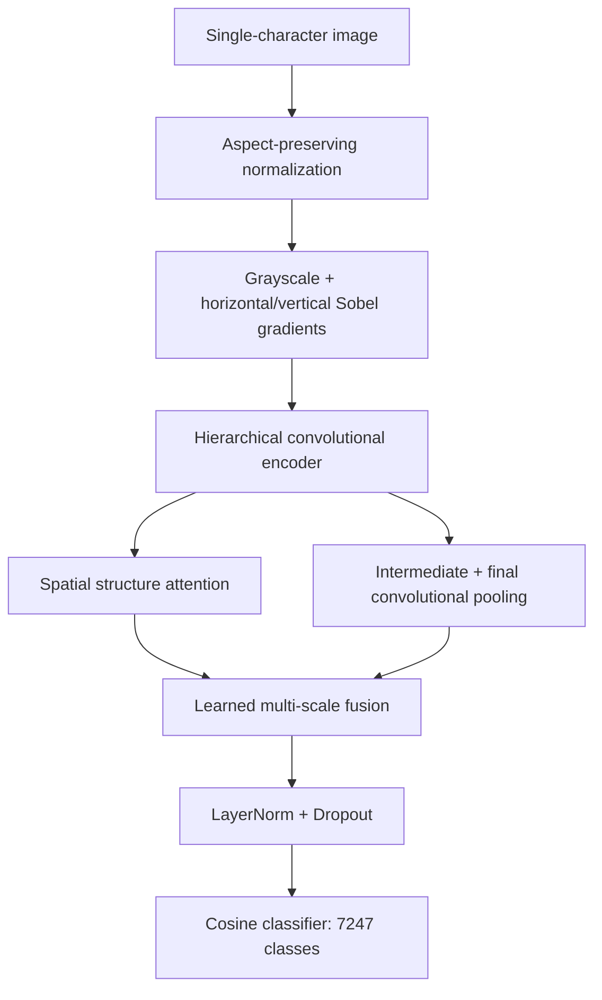

# GlyphWeave · 字织

**Integrating Stroke and Structure for Handwritten Character Recognition.**

English | [简体中文](README.zh-CN.md)

GlyphWeave classifies **7,185 Chinese characters, 26 uppercase letters, 26 lowercase letters, and 10 digits: 7,247 classes in total**. It combines stroke gradients, hierarchical convolution, spatial attention, multi-scale fusion, and a cosine classifier. All learnable parameters are randomly initialized.

On the complete 870,895-image test set, GlyphWeave achieves **95.95% Top-1, 99.65% Top-5, and 97.64% macro Top-1**. See [Experimental results](#experiments) for the evaluation protocol and character-group analysis.

## Highlights

- Stroke-aware input: grayscale images with fixed horizontal and vertical Sobel gradients.
- Hierarchical encoding: large-kernel depthwise convolution and low-resolution spatial attention.
- Shared preprocessing for training and inference, with aspect ratio preserved.
- Apple Silicon MPS and single-GPU Windows CUDA training, EMA, mixed precision, and checkpoint recovery.
- Auditable data splits and evaluation: overall, per-class, and character-group metrics.

<a id="architecture"></a>

## Model architecture

GlyphWeave combines *glyph*, meaning a character shape, with *weave*, reflecting the fusion of stroke details and spatial structure. Its Chinese name is **字织**. The model is implemented as `HandwritingNet` in `handwriting/model.py`, with configuration identifier `handwriting_net`.

The encoder uses residual depthwise convolution blocks with channel expansion and global response normalization (GRN), drawing on [ConvNeXt V2](https://github.com/facebookresearch/ConvNeXt-V2). Spatial attention operates on the final feature grid to model character structure at a manageable token count. Intermediate convolutional features, final convolutional features, and attention features are pooled and fused with learned weights.



| Configuration | Input | Parameters | Channels | Depths | Attention blocks |
|---|---|---:|---|---|---:|
| `mac.yaml` / `windows_cuda.yaml` | 128 × 128 | 7,820,044 | 40 / 80 / 160 / 320 | 2 / 2 / 6 / 2 | 2 |
| `quality.yaml` | 160 × 160 | 14,053,588 | 48 / 96 / 192 / 384 | 2 / 3 / 8 / 3 | 3 |

Parameter counts include the classification head. `quality.yaml` provides a larger experimental configuration. See the [architecture notes](docs/网络设计.md) for module definitions and design rationale.

<a id="dataset-downloads"></a>

## Data and downloads

Dataset files and model checkpoints are distributed separately from the source repository. The model packages are available in v1.0.0.

| Artifact | Contents | Download | Version / SHA-256 |
|---|---|---|---|
| Prepared dataset | `metadata.json`, `index.npy`, and all referenced `raw/` files | [Hugging Face](https://huggingface.co/datasets/GeorgeWJJ/GlyphWeave) · [Baidu Netdisk](https://pan.baidu.com/s/1vDiqiz0qkBu2fWVgWQLwnA?pwd=v8ri) (access code: `v8ri`) | — |
| Inference model | EMA weights and experiment records | [Inference ZIP](https://github.com/13536309143/GlyphWeave/releases/download/v1.0.0/glyphweave-v1.0.0-inference.zip) | v1.0.0 / [SHA-256](https://github.com/13536309143/GlyphWeave/releases/download/v1.0.0/SHA256SUMS.txt) |
| Full training checkpoint | Original best checkpoint and experiment records | [Training ZIP](https://github.com/13536309143/GlyphWeave/releases/download/v1.0.0/glyphweave-v1.0.0-training.zip) | v1.0.0 / [SHA-256](https://github.com/13536309143/GlyphWeave/releases/download/v1.0.0/SHA256SUMS.txt) |

Upstream sources:

- [EMNIST — NIST](https://www.nist.gov/itl/products-and-services/emnist-dataset): ByClass preserves uppercase and lowercase labels.
- [CASIA-HWDB downloads](https://nlpr.ia.ac.cn/databases/handwriting/Download.html): offline isolated handwritten characters.
- [CASIA mirror used for this project](https://huggingface.co/datasets/OrkaZeta/HWDB1/tree/main): a third-party source used when the original server was inaccessible.

Dataset access and redistribution remain subject to the respective upstream terms, including the [CASIA agreement](https://nlpr.ia.ac.cn/databases/handwriting/Application_form.html).

Hugging Face and Baidu Netdisk host the same prepared dataset; download from either source. Place the complete `processed/` directory in `data/processed/`, including `metadata.json`, `index.npy`, and all referenced `raw/` files. See [dataset preparation and integrity](docs/数据集.md).

| Split | Images | Classes |
|---|---:|---:|
| Training | 3,353,310 | 7,247 |
| Validation | 374,648 | 7,247 |
| Test | 870,895 | 7,247 |

CASIA retains the official test set and holds out validation writers from the official training set; writers do not overlap across splits. EMNIST retains its official test set and uses class-stratified training/validation sampling; writer IDs are unavailable, so writer separation cannot be established for those two splits. Preparation removes 135 zero-size records and 1 blank image, excludes non-target symbols, and applies one transpose to EMNIST images during loading.

<a id="released-model"></a>

## Released model

The [v1.0.0 release](https://github.com/13536309143/GlyphWeave/releases/tag/v1.0.0) provides an inference package containing the selected EMA weights and a separate full training checkpoint package. Both include the configuration, class mapping, history, test report, figures, and manifest; verify `SHA256SUMS.txt` before loading a download.

For recognition, download and extract `glyphweave-v1.0.0-inference.zip` into the project root after installing dependencies. The dataset is **not required for single-image inference**.

```bash
.venv/bin/python predict.py path/to/glyph.png --checkpoint glyphweave-v1.0.0-inference/best.pt
.venv/bin/python app.py --checkpoint glyphweave-v1.0.0-inference/best.pt
```

On Windows, use `.\.venv-win\Scripts\python.exe` in place of `.venv/bin/python`. The inference checkpoint cannot resume training. The full checkpoint preserves the original optimizer and scheduler state, but the 80-epoch schedule is already complete; extending it requires a new experiment rather than changing `epochs` during recovery. Package details are documented in the [release notes](docs/releases/v1.0.0.md).

<a id="quick-start"></a>

## Quick start

Clone the repository and download the dataset described above before training.

```bash
git clone https://github.com/13536309143/GlyphWeave.git
cd GlyphWeave
```

### Apple Silicon / MPS

The pinned dependencies in `requirements.txt` require the following environment:

| Item | Requirement |
|---|---|
| Hardware / architecture | Apple Silicon, native `arm64` Python |
| Operating system | macOS 14 or later |
| Python | Standard CPython 3.12–3.14; Python 3.14.1 is excluded by torchvision |
| Training backend / precision | MPS / FP32 |

These requirements follow the published [PyTorch wheels](https://pypi.org/project/torch/2.14.1/#files), [torchvision metadata](https://pypi.org/project/torchvision/0.29.1/), and [NumPy metadata](https://pypi.org/project/numpy/2.5.3/). Use a native interpreter with the versions above; macOS Python installations are described in the [Python documentation](https://docs.python.org/3/using/mac.html).

The commands below use Python 3.14. Check the operating system, Python version, and architecture (`arm64`), then create an environment, install dependencies, and verify MPS and the dataset before training:

```bash
sw_vers -productVersion
python3.14 --version
python3.14 -c "import platform; print(platform.machine())"
python3.14 -m venv .venv
.venv/bin/python -m pip install --upgrade pip
.venv/bin/python -m pip install -r requirements.txt
.venv/bin/python -m pip check
.venv/bin/python check_environment.py --device mps
.venv/bin/python train.py --config configs/mac.yaml
```

For Python 3.12 or 3.13, replace `python3.14` with the matching interpreter command. If using source data files, run `.venv/bin/python prepare_data.py` before the environment check. The check should report `device: mps` and `gpu_kernel_check: passed`.

### Windows / NVIDIA CUDA

The installation below uses Python 3.14 and **PyTorch 2.11.0 + torchvision 0.26.0 with CUDA 12.8**. See the [official version combinations](https://pytorch.org/get-started/previous-versions/) and [installation selector](https://pytorch.org/get-started/locally/) for alternative environments.

The PyTorch wheels include the CUDA runtime; this project does not require compiling CUDA extensions. The NVIDIA driver must support the selected runtime. See [CUDA compatibility](https://docs.nvidia.com/deploy/cuda-compatibility/why-cuda-compatibility.html).

In PowerShell, from the project directory, install without activating the environment:

```powershell
python --version
python -m venv .venv-win
.\.venv-win\Scripts\python.exe -m pip install --upgrade pip
.\.venv-win\Scripts\python.exe -m pip install "torch==2.11.0" "torchvision==0.26.0" --index-url https://download.pytorch.org/whl/cu128
.\.venv-win\Scripts\python.exe -m pip install -r requirements-windows.txt
.\.venv-win\Scripts\python.exe -m pip check
```

PyTorch is installed separately from `requirements-windows.txt`; the Mac `requirements.txt` is not the Windows installation recipe. Copy the entire prepared dataset into `data/processed/`. If using source files, run `.\.venv-win\Scripts\python.exe prepare_data.py` before checking the environment.

Verify the GPU, PyTorch runtime, CUDA computation, and dataset paths:

```powershell
nvidia-smi --query-gpu=name,memory.total,driver_version --format=csv
.\.venv-win\Scripts\python.exe -c "import torch; print('torch:', torch.__version__); print('CUDA runtime:', torch.version.cuda); print('CUDA available:', torch.cuda.is_available())"
.\.venv-win\Scripts\python.exe check_environment.py --device cuda
```

For this installation, the expected package/runtime values are `2.11.0+cu128` and `12.8`. CUDA availability should be `True`, and the device check should report `gpu_kernel_check: passed`.

**Configuration for approximately 8 GB VRAM:** copy the default configuration into a separate experiment file:

```powershell
Copy-Item configs\windows_cuda.yaml configs\windows_8gb.yaml
```

Before starting a fresh run, edit these fields in `configs/windows_8gb.yaml`, retaining the other settings:

```yaml
run_dir: runs/windows_8gb
batch_size: 8
accumulation: 8
```

Keep `precision: fp16` and `image_size: 128`; the effective batch remains 64. Adjust the batch size to available VRAM. If CUDA reports out-of-memory, use `batch_size: 4` and `accumulation: 16` for a new run. Batch and accumulation settings must match when resuming a checkpoint.

Run a short pipeline check in a separate output directory, then start training from random initialization:

```powershell
.\.venv-win\Scripts\python.exe train.py --config configs/windows_8gb.yaml --run-dir runs/windows_8gb_smoke --smoke-steps 8
.\.venv-win\Scripts\python.exe train.py --config configs/windows_8gb.yaml
```

The smoke checkpoint is for diagnostics and is rejected by normal inference. If worker startup fails, add `--workers 0` to the smoke command to diagnose it. After an interrupted formal run has saved successfully, resume with:

```powershell
.\.venv-win\Scripts\python.exe train.py --config configs/windows_8gb.yaml --resume runs/windows_8gb/last.pt
```

The generic `configs/windows_cuda.yaml` remains available with batch 16 and accumulation 4, outputting to `runs/windows_cuda`. For the configuration above, use `runs/windows_8gb/best.pt` for evaluation and inference. See the [Windows training guide](docs/Windows训练.md) for additional setup and recovery details.

<a id="training"></a>

## Training protocol

The default Mac and Windows configurations share the following optimization settings.

| Setting | Value |
|---|---|
| Optimizer / learning rate / weight decay | AdamW / 0.0005 / 0.05 |
| Effective batch | 64 = 16 × 4 accumulation steps |
| Sampling | 250,000 draws per epoch, with replacement; per-sample weight ∝ inverse square root of class frequency |
| Schedule | 2 warmup epochs, cosine decay, up to 80 epochs |
| Regularization | Label smoothing 0.05, DropPath, dropout, mild geometric augmentation |
| EMA / gradient norm clipping | 0.999 / 1.0 |
| Model selection / early stopping | Validation macro Top-1 of EMA weights / patience 12 |

An epoch is a fixed sampling budget, **not a complete traversal of the training set**. The default validation subset contains 72,470 images, with 10 per class. Set `validation_limit: null` in a new experiment to use the full validation set. Select configurations on validation data; keep the test set for final evaluation.

`last.pt` stores recovery state; `best.pt` stores the best validation-selected EMA checkpoint. Training saves every 1,000 successful optimizer updates, at epoch boundaries, and on a handled interruption. Resume with the same configuration:

```bash
.venv/bin/python train.py --config configs/mac.yaml --resume runs/mac/last.pt
```

Device, worker count, precision, and paths may change during recovery; incompatible architecture, batch, or schedule changes are rejected. Not all random-number-generator states are saved, so recovery does not guarantee bitwise reproducibility. CUDA AMP overflow skips optimizer, scheduler, and EMA updates together.

For a new experiment, choose a new output directory with `--run-dir`. The larger model uses `configs/quality.yaml`; evaluate its checkpoint explicitly rather than relying on the default path.

<a id="evaluation"></a>

## Evaluation and inference

Evaluate the complete independent test set, classify one image, or start the local upload page:

```bash
.venv/bin/python evaluate.py --checkpoint runs/mac/best.pt --output runs/mac/test_metrics.json
.venv/bin/python predict.py path/to/glyph.png --checkpoint runs/mac/best.pt
.venv/bin/python app.py --checkpoint runs/mac/best.pt
```

On Windows, replace `.venv/bin/python` with `.\.venv-win\Scripts\python.exe` and use `runs/windows_cuda/best.pt` and `runs/windows_cuda/test_metrics.json`. Open [the local page](http://127.0.0.1:7860) after starting `app.py`. Prediction supports `--group chinese` when the character group is known.

For the 8 GB configuration described above, use its own checkpoint and report directory:

```powershell
.\.venv-win\Scripts\python.exe evaluate.py --checkpoint runs/windows_8gb/best.pt --output runs/windows_8gb/test_metrics.json --device cuda
.\.venv-win\Scripts\python.exe predict.py path/to/glyph.png --checkpoint runs/windows_8gb/best.pt --device cuda
.\.venv-win\Scripts\python.exe app.py --checkpoint runs/windows_8gb/best.pt --device cuda
```

Evaluation reports Top-1, Top-5, macro Top-1, Chinese/digit/uppercase/lowercase metrics, and confusion pairs. The complete test set has 870,895 images. `--limit` produces a subset check and must be labeled as such.

Inputs should contain a single clearly cropped character. Whole lines, documents, out-of-vocabulary characters, and complex backgrounds require additional models or data. Scores are uncalibrated; visually ambiguous forms such as `O/0` and `l/I/1` may require context. Report character-group metrics because Chinese classes dominate the aggregate.

<a id="repository"></a>

## Repository layout and verification

```text
GlyphWeave/
├── handwriting/
├── configs/
├── docs/
│   └── assets/
├── scripts/check_readme_sync.py
├── tests/
├── prepare_data.py
├── check_environment.py
├── train.py
├── evaluate.py
├── predict.py
├── app.py
├── README.md
├── README.zh-CN.md
├── LICENSE
└── AGENTS.md
```

`handwriting/` contains the model, dataset, preprocessing, runtime, and metrics. `configs/` defines reproducible runs. `docs/` contains architecture, platform, data, and experiment documentation. Datasets, environments, checkpoints, and local runs are excluded through `.gitignore`.

Run the documentation and pipeline checks. Pipeline tests require the prepared dataset:

```bash
python3 scripts/check_readme_sync.py
.venv/bin/python -m unittest discover -s tests -v
```

CUDA-specific tests require an NVIDIA GPU. Development and publishing procedures are documented in the [GitHub publishing guide](docs/GitHub发布.md).

## License

The source code and project-authored documentation are licensed under the [MIT License](LICENSE). Retain the copyright and license notices when redistributing them. Dataset files and separately distributed model checkpoints are outside the scope of this source-code license. Datasets retain their respective upstream terms, including the [CASIA agreement](https://nlpr.ia.ac.cn/databases/handwriting/Application_form.html); third-party dependencies retain their own licenses.

## References

- [ConvNeXt V2 — architectural inspiration and GRN](https://github.com/facebookresearch/ConvNeXt-V2)
- [EMNIST — dataset source](https://www.nist.gov/itl/products-and-services/emnist-dataset)
- [CASIA handwriting database — dataset source](https://nlpr.ia.ac.cn/databases/handwriting/home.html)
- [PyTorch — framework and installation](https://pytorch.org/get-started/locally/)

<a id="experiments"></a>

## Experimental results

Version **v1.0.0** reports one training run of the default GlyphWeave model, trained from scratch on Windows CUDA with seed 42.

### Experimental setup

| Item | Value |
|---|---|
| Configuration / initialization | `configs/windows_cuda.yaml` / random initialization, no pretrained weights |
| Parameters / input / seed | 7,820,044 / 128 × 128 / 42 |
| Precision / effective batch | FP16 AMP / 64 = 16 × 4 accumulation steps |
| Optimizer / learning rate / weight decay | AdamW / 0.0005 / 0.05 |
| Schedule / EMA | 2 warmup epochs, cosine decay / 0.999 |
| Completed budget | 80 epochs × 250,000 sampled images = 20,000,000 draws with replacement |
| Successful updates / skipped updates | 312,445 / 115 |
| Model selection | Best EMA by validation macro Top-1; best epoch 80 |
| Validation protocol | Fixed 72,470-image subset, 10 images per class |
| Test protocol | Complete independent split: 870,895 images, 7,247 classes |
| Hardware | NVIDIA GeForce RTX 4070 family, 8,188 MiB VRAM |
| Platform | Windows, 64-bit Python 3.14.7 |
| Dataset index SHA-256 | `ab95cdd227094c2e2b221ff958adce0d42b6b30a76089473316cbf4ec6b380b3` |

The [configuration](docs/experiments/windows_cuda_v1/config.json), [training history](docs/experiments/windows_cuda_v1/history.jsonl), and [test report](docs/experiments/windows_cuda_v1/test_metrics.json) accompany the experiment. File hashes and provenance details are included in the [release notes](docs/releases/v1.0.0.md).

### Validation and full-test results

| Split | Images | Top-1 (%) | Top-5 (%) | Macro Top-1 (%) |
|---|---:|---:|---:|---:|
| Validation subset, best epoch 80 | 72,470 | 97.66 | 99.70 | 97.66 |
| Complete independent test | 870,895 | **95.95** | **99.65** | **97.64** |

### Character groups on the complete test set

| Group | Test images | Top-1 (%) | Representative confusions |
|---|---:|---:|---|
| Chinese | 742,069 | **97.59** | 汆 / 氽, 谭 / 潭 |
| Digits | 59,934 | **93.71** | `0 / O`, `1 / I / l` |
| Uppercase | 36,590 | **83.72** | `O / 0`, `I / 1`, `C / c` |
| Lowercase | 32,302 | **76.32** | `l / 1`, `c / C`, `s / S` |

Letters and digits account for 0.86% of the validation subset and 14.79% of the test set, so the overall metrics reflect different character-group proportions. Macro Top-1 is the mean accuracy across the 7,247 character classes. Validation and test group metrics also differ in sample counts and within-group class frequencies.

### Training dynamics

Validation Top-1 reached 88.12% at epoch 3, 95.48% at epoch 8, 96.68% at epoch 20, 97.25% at epoch 50, and 97.66% at epoch 80. The last 10 epochs added approximately 0.095 percentage points, indicating diminishing gains. Final training loss was 0.7731 and validation loss was 0.1231; augmentation, label smoothing, and EMA make these losses unsuitable for direct train/validation gap comparison.

### Error analysis and scope

| Actual → predicted | Misclassified test images |
|---|---:|
| `O → 0` | 1,672 |
| `l → 1` | 1,600 |
| `0 → O` | 1,258 |
| `I → 1` | 803 |

These four directional confusions account for 15.14% of all Top-1 errors. Lowercase letters are the weakest group, with frequent ambiguities between letters and digits. The evaluation covers a single seed on isolated-character datasets; it does not measure baseline comparisons, ablations, multi-seed variability, inference latency, or accuracy on external photographs.

### Learning curves and confusion overview


[Vector figure](docs/assets/windows-cuda-v1-overview.svg) · [Machine-readable experiment summary](docs/experiments/windows_cuda_v1/experiment-summary.json).
