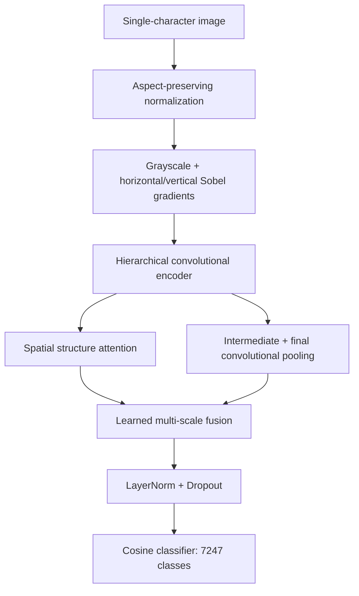

# HandwritingNet

**A convolution–attention framework for handwritten character recognition, trained from scratch.**

English | [简体中文](README.zh-CN.md)

HandwritingNet classifies **7,185 Chinese characters, 26 uppercase letters, 26 lowercase letters, and 10 digits: 7,247 classes in total**. It combines stroke gradients, hierarchical convolution, spatial attention, multi-scale fusion, and a cosine classifier. All learnable parameters are randomly initialized.

The project implements an independent combination of established architectural components. Complete benchmark experiments are pending; no state-of-the-art claim is made. Reserved tables and figures appear in [Experimental results](#experiments).

## Highlights

- Stroke-aware input: grayscale images with fixed horizontal and vertical Sobel gradients.
- Hierarchical encoding: large-kernel depthwise convolution and low-resolution spatial attention.
- Shared preprocessing for training and inference, with aspect ratio preserved.
- Apple Silicon MPS and single-GPU Windows CUDA training, EMA, mixed precision, and checkpoint recovery.
- Auditable data splits and evaluation: overall, per-class, and character-group metrics.

<a id="architecture"></a>

## Model architecture

The encoder uses residual depthwise convolution blocks with channel expansion and global response normalization (GRN), drawing on [ConvNeXt V2](https://github.com/facebookresearch/ConvNeXt-V2). Spatial attention operates on the final feature grid to model character structure at a manageable token count. Intermediate convolutional features, final convolutional features, and attention features are pooled and fused with learned weights.



| Configuration | Input | Parameters | Channels | Depths | Attention blocks |
|---|---|---:|---|---|---:|
| `mac.yaml` / `windows_cuda.yaml` | 128 × 128 | 7,820,044 | 40 / 80 / 160 / 320 | 2 / 2 / 6 / 2 | 2 |
| `quality.yaml` | 160 × 160 | 14,053,588 | 48 / 96 / 192 / 384 | 2 / 3 / 8 / 3 | 3 |

Parameter counts include the classification head. The larger configuration is an experimental option; improved accuracy must be established by measurement. See the [architecture notes](docs/网络设计.md) for module definitions and design rationale.

<a id="dataset-downloads"></a>

## Data and downloads

Dataset files and model checkpoints are distributed separately from this source repository. The release links below will be filled in after the corresponding artifacts are uploaded.

<!-- DATASET_RELEASE_LINKS: update both READMEs when real release URLs are available. -->

| Artifact | Contents | Download | Version / SHA-256 |
|---|---|---|---|
| Prepared dataset | `metadata.json`, `index.npy`, and all referenced `raw/` files | **Pending upload** | Pending |
| Source data | CASIA-HWDB 1.0–1.2 and EMNIST ByClass files | **Pending upload** | Pending |
| Trained model | Checkpoint, configuration, and evaluation report | **Pending experiments** | Pending |

Upstream sources:

- [EMNIST — NIST](https://www.nist.gov/itl/products-and-services/emnist-dataset): ByClass preserves uppercase and lowercase labels.
- [CASIA-HWDB downloads](https://nlpr.ia.ac.cn/databases/handwriting/Download.html): offline isolated handwritten characters.
- [CASIA mirror used for this project](https://huggingface.co/datasets/OrkaZeta/HWDB1/tree/main): a third-party source used when the original server was inaccessible.

Dataset access and redistribution remain subject to the respective upstream terms, including the [CASIA agreement](https://nlpr.ia.ac.cn/databases/handwriting/Application_form.html).

For a prepared release, extract the **entire** directory into `data/processed/`; the index alone is insufficient. For source files, restore `data/CASIA-HWDB/` and `data/EMNIST/`, then run `prepare_data.py` after installing dependencies. See [dataset packaging and integrity](docs/数据集.md).

| Split | Images | Classes |
|---|---:|---:|
| Training | 3,353,310 | 7,247 |
| Validation | 374,648 | 7,247 |
| Test | 870,895 | 7,247 |

CASIA retains the official test set and holds out validation writers from the official training set; writers do not overlap across splits. EMNIST retains its official test set and uses class-stratified training/validation sampling; writer IDs are unavailable, so writer separation cannot be established for those two splits. Preparation removes 135 zero-size records and 1 blank image, excludes non-target symbols, and applies one transpose to EMNIST images during loading.

<a id="quick-start"></a>

## Quick start

Clone the repository and download the dataset described above before training.

```bash
git clone https://github.com/13536309143/write.git
cd write
```

### Apple Silicon / MPS

Create an environment, install dependencies, check the device and data, then start training.

```bash
python3 -m venv .venv
.venv/bin/python -m pip install -r requirements.txt
.venv/bin/python check_environment.py --device auto
.venv/bin/python train.py --config configs/mac.yaml
```

If only source files were downloaded, run `.venv/bin/python prepare_data.py` before the environment check. MPS training uses FP32. A `KeyboardInterrupt` during `import torch` means startup was cancelled before training began; rerun the command.

### Windows / NVIDIA CUDA

Use a supported 64-bit Python environment; the commands below use Python 3.12 and the CUDA 12.8 wheel index. Check the [official PyTorch installation selector](https://pytorch.org/get-started/locally/) for compatibility with your NVIDIA driver. PyTorch is installed separately from `requirements-windows.txt`.

```powershell
py -3.12 -m venv .venv-win
.\.venv-win\Scripts\python.exe -m pip install --upgrade pip
.\.venv-win\Scripts\python.exe -m pip install "torch>=2.5,<3" "torchvision>=0.20,<1" --index-url https://download.pytorch.org/whl/cu128
.\.venv-win\Scripts\python.exe -m pip install -r requirements-windows.txt
.\.venv-win\Scripts\python.exe check_environment.py --device cuda
.\.venv-win\Scripts\python.exe train.py --config configs/windows_cuda.yaml
```

If using source files, run `.\.venv-win\Scripts\python.exe prepare_data.py` before the environment check. This configuration requires CUDA, uses FP16 AMP, and starts a new run in `runs/windows_cuda` without loading Mac weights. See the [Windows training guide](docs/Windows训练.md) for setup, memory tuning, and recovery.

<a id="training"></a>

## Training protocol

The default Mac and Windows configurations share the following optimization settings.

| Setting | Value |
|---|---|
| Optimizer / learning rate / weight decay | AdamW / 0.0005 / 0.05 |
| Effective batch | 64 = 16 × 4 accumulation steps |
| Sampling | 250,000 draws per epoch, with replacement; per-sample weight ∝ inverse square root of class frequency |
| Schedule | 2 warmup epochs, cosine decay, up to 80 epochs |
| Regularization | Label smoothing 0.05, DropPath, dropout, mild geometric augmentation |
| EMA / gradient norm clipping | 0.999 / 1.0 |
| Model selection / early stopping | Validation macro Top-1 of EMA weights / patience 12 |

An epoch is a fixed sampling budget, **not a complete traversal of the training set**. The default validation subset contains 72,470 images, with 10 per class. Set `validation_limit: null` in a new experiment to use the full validation set. Select configurations on validation data; keep the test set for final evaluation.

`last.pt` stores recovery state; `best.pt` stores the best validation-selected EMA checkpoint. Training saves every 1,000 successful optimizer updates, at epoch boundaries, and on a handled interruption. Resume with the same configuration:

```bash
.venv/bin/python train.py --config configs/mac.yaml --resume runs/mac/last.pt
```

Device, worker count, precision, and paths may change during recovery; incompatible architecture, batch, or schedule changes are rejected. Not all random-number-generator states are saved, so recovery does not guarantee bitwise reproducibility. CUDA AMP overflow skips optimizer, scheduler, and EMA updates together.

For a new experiment, choose a new output directory with `--run-dir`. The larger model uses `configs/quality.yaml`; evaluate its checkpoint explicitly rather than relying on the default path.

<a id="evaluation"></a>

## Evaluation and inference

Evaluate the complete independent test set, classify one image, or start the local upload page:

```bash
.venv/bin/python evaluate.py --checkpoint runs/mac/best.pt --output runs/mac/test_metrics.json
.venv/bin/python predict.py path/to/glyph.png --checkpoint runs/mac/best.pt
.venv/bin/python app.py --checkpoint runs/mac/best.pt
```

On Windows, replace `.venv/bin/python` with `.\.venv-win\Scripts\python.exe` and use `runs/windows_cuda/best.pt` and `runs/windows_cuda/test_metrics.json`. Open [the local page](http://127.0.0.1:7860) after starting `app.py`. Prediction supports `--group chinese` when the character group is known.

Evaluation reports Top-1, Top-5, macro Top-1, Chinese/digit/uppercase/lowercase metrics, and confusion pairs. The complete test set has 870,895 images. `--limit` produces a subset check and must be labeled as such.

Inputs should contain a single clearly cropped character. Whole lines, documents, out-of-vocabulary characters, and complex backgrounds require additional models or data. Scores are uncalibrated; visually ambiguous forms such as `O/0` and `l/I/1` may require context. Report character-group metrics because Chinese classes dominate the aggregate.

<a id="repository"></a>

## Repository layout and verification

```text
write/
├── handwriting/
├── configs/
├── docs/
│   └── assets/
├── scripts/check_readme_sync.py
├── tests/
├── prepare_data.py
├── check_environment.py
├── train.py
├── evaluate.py
├── predict.py
├── app.py
├── README.md
├── README.zh-CN.md
└── AGENTS.md
```

`handwriting/` contains the model, dataset, preprocessing, runtime, and metrics. `configs/` defines reproducible runs. `docs/` contains architecture, platform, data, and experiment documentation. Datasets, environments, checkpoints, and local runs are excluded through `.gitignore`.

English is the default README. The [Chinese README](README.zh-CN.md) must remain equivalent in content, structure, commands, links, and results. This policy is recorded in [AGENTS.md](AGENTS.md). Check documentation consistency and, with the prepared dataset installed, run the pipeline tests:

```bash
python3 scripts/check_readme_sync.py
.venv/bin/python -m unittest discover -s tests -v
```

The documentation check compares structure and shared technical content, not translation quality. Pipeline checks and tiny-batch fitting demonstrate implementation behavior, not generalization. CUDA-specific tests require an NVIDIA GPU; skipped tests are not CUDA validation. See the [GitHub publishing checklist](docs/GitHub发布.md).

## References

- [ConvNeXt V2 — architectural inspiration and GRN](https://github.com/facebookresearch/ConvNeXt-V2)
- [EMNIST — dataset source](https://www.nist.gov/itl/products-and-services/emnist-dataset)
- [CASIA handwriting database — dataset source](https://nlpr.ia.ac.cn/databases/handwriting/home.html)
- [PyTorch — framework and installation](https://pytorch.org/get-started/locally/)

<a id="experiments"></a>

## Experimental results — reserved

**Complete experiments are pending.** Dashes denote unmeasured values. Interim validation observations are recorded separately in the [experiment log](docs/实验记录.md); they are not full-test results. Use the [experiment report template](docs/实验报告模板.md) when filling this section, and update both READMEs together.

### Experimental setup

| Item | Recorded value |
|---|---|
| Code commit / dataset release / index SHA-256 | Pending |
| OS / Python / PyTorch / CUDA / driver | Pending |
| GPU / VRAM / CPU / RAM | Pending |
| Configuration / seeds / successful updates / sampling budget | Pending |
| Checkpoint selection / evaluation split / image count | Pending |

### Full-test results

| Model | Parameters | Top-1 (%) | Top-5 (%) | Macro Top-1 (%) | Latency (ms/image) |
|---|---:|---:|---:|---:|---:|
| HandwritingNet default | 7,820,044 | — | — | — | — |
| HandwritingNet larger | 14,053,588 | — | — | — | — |
| Matched-budget baseline | — | — | — | — | — |

### Character groups

| Group | Test images | Top-1 (%) | Top-5 (%) | Main confusions |
|---|---:|---:|---:|---|
| Chinese | — | — | — | — |
| Digits | — | — | — | — |
| Uppercase | — | — | — | — |
| Lowercase | — | — | — | — |

### Ablation studies

The following comparisons are planned; not all variants are implemented. Hold data splits, training budget, seed policy, and evaluation protocol constant.

| Variant | Top-1 (%) | Macro Top-1 (%) | Parameters | Interpretation |
|---|---:|---:|---:|---|
| Full model | — | — | — | — |
| Without Sobel input | — | — | — | — |
| Without spatial attention | — | — | — | — |
| Without multi-scale fusion | — | — | — | — |
| Linear classification head | — | — | — | — |

### Learning curves and qualitative examples

Reserve this area for training/validation curves, confusion analysis, and correct/incorrect predictions. Include representative difficult characters and ambiguous letter/digit pairs. Report external-photo evaluation separately from the official test split. Timing measurements should specify hardware, precision, batch size, warmup, and device synchronization.

<!-- EXPERIMENT_FIGURES: enable after real files exist; synchronize both READMEs.


-->
