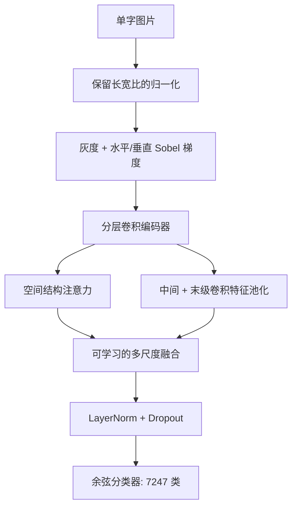

# HandwritingNet

**从零训练的卷积与注意力手写字符识别框架。**

[English](README.md) | 简体中文

HandwritingNet 支持识别 **7,185 个汉字、26 个大写字母、26 个小写字母和 10 个数字，共 7,247 类**。网络结合笔画梯度、分层卷积、空间注意力、多尺度融合与余弦分类器，所有可学习参数均从随机初始化开始训练。

本项目自主实现并组合成熟的网络组件。完整基准实验尚待完成，当前不宣称达到最先进水平。预留的实验表格与图片位置位于文末的[实验结果](#experiments)。

## 项目特点

- 笔画感知输入：灰度图像与固定的水平、垂直 Sobel 梯度。
- 分层特征编码：大核深度卷积与低分辨率空间注意力。
- 训练与推理共用预处理，并保留字符长宽比。
- 支持 Apple Silicon MPS 与 Windows 单卡 CUDA 训练、EMA、混合精度及断点恢复。
- 可检查的数据划分与评估：提供整体、各类别及字符分组指标。

<a id="architecture"></a>

## 网络结构

编码器采用具有通道扩张与全局响应归一化（GRN）的残差深度卷积块，设计参考 [ConvNeXt V2](https://github.com/facebookresearch/ConvNeXt-V2)。空间注意力作用于末级特征网格，在控制 token 数量的同时建模字符结构。中间卷积特征、末级卷积特征与注意力特征经池化后使用可学习权重融合。



| 配置 | 输入 | 参数量 | 通道数 | 各阶段深度 | 注意力块数 |
|---|---|---:|---|---|---:|
| `mac.yaml` / `windows_cuda.yaml` | 128 × 128 | 7,820,044 | 40 / 80 / 160 / 320 | 2 / 2 / 6 / 2 | 2 |
| `quality.yaml` | 160 × 160 | 14,053,588 | 48 / 96 / 192 / 384 | 2 / 3 / 8 / 3 | 3 |

参数量包含分类头。扩大配置用于进一步实验，是否提高准确率需要实测。模块定义与设计依据见[网络设计说明](docs/网络设计.md)。

<a id="dataset-downloads"></a>

## 数据与下载

数据集文件和模型检查点与源码仓库分别发布。对应文件上传完成后，将在下表补充下载链接。

<!-- DATASET_RELEASE_LINKS: 获得真实发布地址后，同步更新两份 README。 -->

| 文件 | 内容 | 下载 | 版本 / SHA-256 |
|---|---|---|---|
| 处理后的数据集 | `metadata.json`、`index.npy` 及引用的全部 `raw/` 文件 | **待上传** | 待补充 |
| 原始数据 | CASIA-HWDB 1.0–1.2 与 EMNIST ByClass 文件 | **待上传** | 待补充 |
| 训练模型 | 检查点、配置与评估报告 | **待完成实验** | 待补充 |

上游来源：

- [EMNIST — NIST](https://www.nist.gov/itl/products-and-services/emnist-dataset)：ByClass 保留大小写字母的独立标签。
- [CASIA-HWDB 下载页面](https://nlpr.ia.ac.cn/databases/handwriting/Download.html)：离线手写单字数据。
- [本项目使用的 CASIA 镜像](https://huggingface.co/datasets/OrkaZeta/HWDB1/tree/main)：原服务器无法访问时使用的第三方来源。

数据集的获取和再分发仍遵循各上游条款，包括 [CASIA 使用协议](https://nlpr.ia.ac.cn/databases/handwriting/Application_form.html)。

下载处理后的数据时，应将**整个**目录解压到 `data/processed/`，仅有索引不足以训练。使用原始文件时，恢复 `data/CASIA-HWDB/` 与 `data/EMNIST/`，安装依赖后运行 `prepare_data.py`。打包与校验方法见[数据集说明](docs/数据集.md)。

| 划分 | 图像数量 | 类别数量 |
|---|---:|---:|
| 训练 | 3,353,310 | 7,247 |
| 验证 | 374,648 | 7,247 |
| 测试 | 870,895 | 7,247 |

CASIA 保留官方测试集，并从官方训练书写者中划出验证书写者，三个划分的书写者互不重叠。EMNIST 保留官方测试集，训练与验证按类别分层抽样；由于没有书写者 ID，无法证明这两个划分的书写者隔离。数据准备过滤 135 条零尺寸记录和 1 张空白图，排除非目标符号，并在加载时对 EMNIST 图像转置一次。

<a id="quick-start"></a>

## 快速开始

克隆仓库，并在训练前下载上述数据集。

```bash
git clone https://github.com/13536309143/write.git
cd write
```

### Apple Silicon / MPS

创建环境、安装依赖、检查设备和数据，然后开始训练。

```bash
python3 -m venv .venv
.venv/bin/python -m pip install -r requirements.txt
.venv/bin/python check_environment.py --device auto
.venv/bin/python train.py --config configs/mac.yaml
```

如果下载的是原始文件，请在环境检查前运行 `.venv/bin/python prepare_data.py`。MPS 训练使用 FP32。若在 `import torch` 时出现 `KeyboardInterrupt`，说明训练开始前取消了启动，重新运行命令即可。

### Windows / NVIDIA CUDA

**目标电脑提供的配置（2026-10-09；尚未在该电脑完成安装与训练验证）：**

| 项目 | 提供的数值 |
|---|---|
| 项目目录 | `E:\write` |
| Python | 3.14.7，64 位 |
| GPU | NVIDIA GeForce RTX 4070 系列；提供的输出截断了完整型号 |
| 显存 | 总计 8,188 MiB；截图时已使用 5,209 MiB |
| NVIDIA 驱动 | 616.64 |
| 本机 CUDA Toolkit（`nvcc`） | 13.4.92 |

沿用现有的标准 Python 3.14 环境。版本检查命令为 `python --version`，需要两个短横线。以下安装固定为 **PyTorch 2.11.0 + torchvision 0.26.0，CUDA 12.8**：这是[官方版本配对](https://pytorch.org/get-started/previous-versions/)，且 [torch](https://download.pytorch.org/whl/cu128/torch/) 与 [torchvision](https://download.pytorch.org/whl/cu128/torchvision/) 索引均提供 Python 3.14 的 Windows wheel。这是明确选定的安装组合，不代表最新版本。

`nvcc` 显示的 CUDA Toolkit、`nvidia-smi` 显示的驱动能力，以及 PyTorch 使用的 CUDA 运行时属于不同版本。较新的 NVIDIA 驱动通过[向后兼容](https://docs.nvidia.com/deploy/cuda-compatibility/why-cuda-compatibility.html)支持较旧的 CUDA 运行时。保留已安装的 Toolkit 即可；本项目使用预编译 wheel，不编译 CUDA 扩展。不要因为本机 Toolkit 是 13.4 就把安装索引改为 `cu134`。选择其他安装组合时使用[官方安装选择器](https://pytorch.org/get-started/locally/)。

在 PowerShell 中进入项目目录，无需激活环境即可安装：

```powershell
cd E:\write
python --version
python -m venv .venv-win
.\.venv-win\Scripts\python.exe -m pip install --upgrade pip
.\.venv-win\Scripts\python.exe -m pip install "torch==2.11.0" "torchvision==0.26.0" --index-url https://download.pytorch.org/whl/cu128
.\.venv-win\Scripts\python.exe -m pip install -r requirements-windows.txt
.\.venv-win\Scripts\python.exe -m pip check
```

PyTorch 与 `requirements-windows.txt` 分开安装；Mac 的 `requirements.txt` 不作为 Windows 安装方案。将完整处理数据复制到 `data/processed/`。使用原始文件时，请在环境检查前运行 `.\.venv-win\Scripts\python.exe prepare_data.py`。

检查完整显卡名称、已安装的运行时、实际 CUDA 运算与数据路径：

```powershell
nvidia-smi --query-gpu=name,memory.total,memory.used,driver_version --format=csv
.\.venv-win\Scripts\python.exe -c "import torch; print('torch:', torch.__version__); print('CUDA runtime:', torch.version.cuda); print('CUDA available:', torch.cuda.is_available())"
.\.venv-win\Scripts\python.exe check_environment.py --device cuda
```

预期包版本与运行时为 `2.11.0+cu128`、`12.8`；CUDA 可用性应为 `True`，设备检查应报告 `gpu_kernel_check: passed`。它们与本机 Toolkit 版本不同是正常现象。仅凭提供的系统输出，还不能证明 PyTorch 已能执行 CUDA kernel。

**约 8 GB 显存的起始设置：**先关闭不必要的 GPU 应用。截图时仅剩约 2.9 GiB 空闲，因此总显存不等于训练可用显存。复制默认配置，建立独立实验：

```powershell
Copy-Item configs\windows_cuda.yaml configs\windows_8gb.yaml
```

开始全新训练前，在 `configs/windows_8gb.yaml` 中修改以下字段，其余设置保留：

```yaml
run_dir: runs/windows_8gb
batch_size: 8
accumulation: 8
```

保留 `precision: fp16` 与 `image_size: 128`，有效 batch 仍为 64。这是较保守的起始设置，不保证一定能容纳。若 CUDA 报显存不足，在新训练前降低为 `batch_size: 4`、`accumulation: 16`。已有检查点续训时不能改变 batch 与累积次数。

先在独立输出目录运行短流程检查，再从随机初始化开始训练：

```powershell
.\.venv-win\Scripts\python.exe train.py --config configs/windows_8gb.yaml --run-dir runs/windows_8gb_smoke --smoke-steps 8
.\.venv-win\Scripts\python.exe train.py --config configs/windows_8gb.yaml
```

短流程检查点仅供诊断，正常推理会拒绝使用。若加载进程启动失败，可在短流程命令中添加 `--workers 0` 排查。正式训练中断并成功保存后，使用以下命令恢复：

```powershell
.\.venv-win\Scripts\python.exe train.py --config configs/windows_8gb.yaml --resume runs/windows_8gb/last.pt
```

通用的 `configs/windows_cuda.yaml` 仍采用 batch 16、累积 4 次，输出到 `runs/windows_cuda`。上述配置评估与识别时使用 `runs/windows_8gb/best.pt`。更多安装与恢复细节见 [Windows 训练说明](docs/Windows训练.md)。

<a id="training"></a>

## 训练协议

默认 Mac 与 Windows 配置采用以下共同的优化设置。

| 设置 | 数值 |
|---|---|
| 优化器 / 学习率 / 权重衰减 | AdamW / 0.0005 / 0.05 |
| 有效 batch | 64 = 16 × 4 次梯度累积 |
| 抽样 | 每轮有放回抽取 250,000 次；每个样本的权重 ∝ 类别样本数平方根的倒数 |
| 学习率调度 | 2 轮预热、余弦衰减，最多 80 轮 |
| 正则化 | 标签平滑 0.05、DropPath、dropout、轻度几何增强 |
| EMA / 梯度范数裁剪 | 0.999 / 1.0 |
| 模型选择 / 提前停止 | EMA 权重的验证集宏平均 Top-1 / 耐心值 12 |

一轮代表固定的抽样预算，**并非遍历整个训练集**。默认验证子集包含 72,470 张图像，每类 10 张。在新实验中设置 `validation_limit: null` 可使用全量验证集。配置选择使用验证集，测试集留作最终评估。

`last.pt` 保存恢复状态；`best.pt` 保存验证指标最佳的 EMA 检查点。程序每 1,000 次成功优化器更新、每轮结束及正常处理的中断时保存。续训使用相同配置：

```bash
.venv/bin/python train.py --config configs/mac.yaml --resume runs/mac/last.pt
```

恢复时允许改变设备、加载进程数、精度和路径；不兼容的网络、batch 或调度修改会被拒绝。程序没有保存全部随机数生成器状态，因此断点恢复不保证逐位复现。CUDA AMP 溢出时，会同时跳过优化器、调度器与 EMA 更新。

新实验通过 `--run-dir` 指定新的输出目录。扩大模型使用 `configs/quality.yaml`，评估时应显式指定对应检查点，不使用默认路径。

<a id="evaluation"></a>

## 评估与识别

评估完整独立测试集、识别单张图片，或启动本地上传页面：

```bash
.venv/bin/python evaluate.py --checkpoint runs/mac/best.pt --output runs/mac/test_metrics.json
.venv/bin/python predict.py path/to/glyph.png --checkpoint runs/mac/best.pt
.venv/bin/python app.py --checkpoint runs/mac/best.pt
```

Windows 上将 `.venv/bin/python` 替换为 `.\.venv-win\Scripts\python.exe`，并使用 `runs/windows_cuda/best.pt` 与 `runs/windows_cuda/test_metrics.json`。启动 `app.py` 后打开[本地页面](http://127.0.0.1:7860)。已知字符属于汉字时，可在识别命令中添加 `--group chinese`。

使用上述 8 GB 配置时，选择它自己的检查点与报告目录：

```powershell
.\.venv-win\Scripts\python.exe evaluate.py --checkpoint runs/windows_8gb/best.pt --output runs/windows_8gb/test_metrics.json --device cuda
.\.venv-win\Scripts\python.exe predict.py path/to/glyph.png --checkpoint runs/windows_8gb/best.pt --device cuda
.\.venv-win\Scripts\python.exe app.py --checkpoint runs/windows_8gb/best.pt --device cuda
```

评估报告包含 Top-1、Top-5、宏平均 Top-1、汉字/数字/大小写字母分组指标与混淆对。完整测试集包含 870,895 张图像。`--limit` 仅用于子集检查，必须明确标注。

输入应为裁剪清晰的单个字符。整行、文档、范围外字符与复杂背景需要额外模型或数据。当前分数未经校准；`O/0`、`l/I/1` 等外观相近的写法可能需要上下文。由于汉字类别占绝大多数，报告整体成绩时也应提供字符分组指标。

<a id="repository"></a>

## 仓库结构与检查

```text
write/
├── handwriting/
├── configs/
├── docs/
│   └── assets/
├── scripts/check_readme_sync.py
├── tests/
├── prepare_data.py
├── check_environment.py
├── train.py
├── evaluate.py
├── predict.py
├── app.py
├── README.md
├── README.zh-CN.md
└── AGENTS.md
```

`handwriting/` 包含模型、数据集、预处理、运行时与指标实现；`configs/` 定义可复现的训练配置；`docs/` 保存网络结构、平台、数据与实验文档。数据集、环境、检查点和本地训练输出通过 `.gitignore` 排除。

英文为默认 README。[英文 README](README.md) 与中文版必须在内容、结构、命令、链接和结果上保持对应，同步规则已写入 [AGENTS.md](AGENTS.md)。检查文档一致性；安装处理后的数据后，再运行流程测试：

```bash
python3 scripts/check_readme_sync.py
.venv/bin/python -m unittest discover -s tests -v
```

文档检查验证结构与共同的技术内容，翻译质量仍需人工核对。流程测试与小批次拟合用于验证实现行为，不代表泛化能力。CUDA 专项测试需要 NVIDIA GPU，跳过测试不能视为 CUDA 验证通过。发布前可参考 [GitHub 发布检查表](docs/GitHub发布.md)。

## 参考资料

- [ConvNeXt V2 — 网络设计参考与 GRN](https://github.com/facebookresearch/ConvNeXt-V2)
- [EMNIST — 数据集来源](https://www.nist.gov/itl/products-and-services/emnist-dataset)
- [CASIA 手写数据库 — 数据集来源](https://nlpr.ia.ac.cn/databases/handwriting/home.html)
- [PyTorch — 训练框架与安装](https://pytorch.org/get-started/locally/)

<a id="experiments"></a>

## 实验结果——预留

**完整实验尚待完成。** 表格中的横线表示尚未测量。阶段性验证观察单独保存在[实验记录](docs/实验记录.md)，不属于完整测试集成绩。补充本节时可使用[实验报告模板](docs/实验报告模板.md)，并同步更新两份 README。

### 实验设置

| 项目 | 记录值 |
|---|---|
| 代码提交 / 数据发布版本 / 索引 SHA-256 | 待补充 |
| 操作系统 / Python / PyTorch / CUDA / 驱动 | 待补充 |
| GPU / 显存 / CPU / 内存 | 待补充 |
| 配置 / 随机种子 / 成功更新次数 / 抽样预算 | 待补充 |
| 检查点选择规则 / 评估划分 / 图像数量 | 待补充 |

### 完整测试集结果

| 模型 | 参数量 | Top-1 (%) | Top-5 (%) | 宏平均 Top-1 (%) | 延迟 (ms/图像) |
|---|---:|---:|---:|---:|---:|
| HandwritingNet 默认配置 | 7,820,044 | — | — | — | — |
| HandwritingNet 扩大配置 | 14,053,588 | — | — | — | — |
| 相同预算的基线模型 | — | — | — | — | — |

### 字符分组

| 分组 | 测试图像数量 | Top-1 (%) | Top-5 (%) | 主要混淆 |
|---|---:|---:|---:|---|
| 汉字 | — | — | — | — |
| 数字 | — | — | — | — |
| 大写字母 | — | — | — | — |
| 小写字母 | — | — | — | — |

### 消融实验

以下对比属于计划，部分变体尚未实现。对比时固定数据划分、训练预算、随机种子规则和评估协议。

| 变体 | Top-1 (%) | 宏平均 Top-1 (%) | 参数量 | 解释 |
|---|---:|---:|---:|---|
| 完整模型 | — | — | — | — |
| 去掉 Sobel 输入 | — | — | — | — |
| 去掉空间注意力 | — | — | — | — |
| 去掉多尺度融合 | — | — | — | — |
| 使用线性分类头 | — | — | — | — |

### 学习曲线与定性示例

此处预留训练/验证曲线、混淆分析，以及正确和错误的识别样例。应包含具有代表性的困难汉字与易混淆字母/数字。外部照片评估与官方测试划分分别报告。计时结果应注明硬件、精度、batch 大小、预热与设备同步方式。

<!-- EXPERIMENT_FIGURES: 真实文件存在后启用，并同步两份 README。


-->
