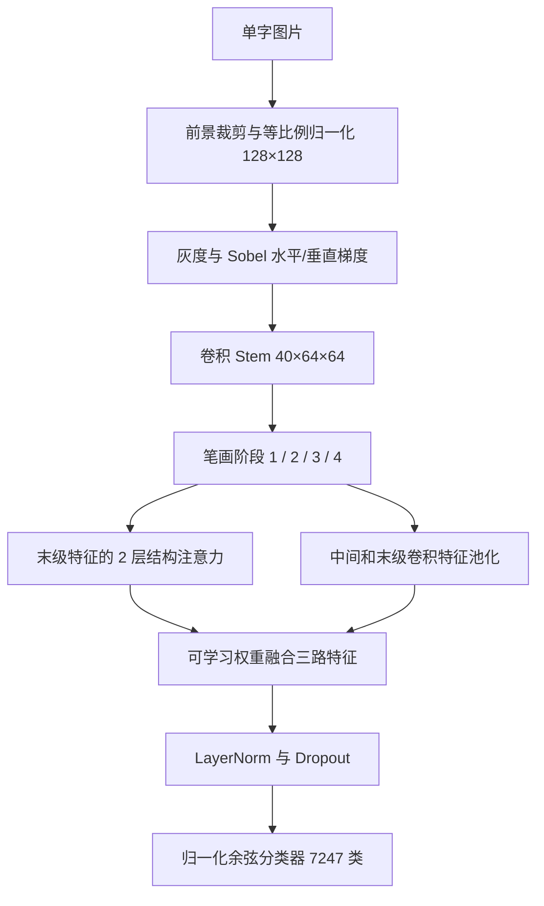

# HandwritingNet 网络设计

设计针对 Apple 芯片本机与 Windows 单卡 CUDA、从随机参数训练、7,247 类离线手写单字分类。目标是在笔画细节、汉字空间结构和计算量之间取得实用平衡。项目名称为 GlyphWeave，现有网络类名保留 HandwritingNet；首次 Windows CUDA 完整实验已完成，正式结果见 [v1.0.0 发布说明](releases/v1.0.0.md)。

## 默认结构

输入是 128×128 灰度图，保留长宽比、去掉多余边缘、留出边距，转换为背景 −1、笔画 +1。固定 Sobel 滤波生成水平、垂直梯度，与灰度输入拼接。滤波核不是预训练参数，所有可学习参数随机初始化。

| 组件 | 输出 C×H×W / 向量 | 结构 |
|---|---|---|
| 梯度输入 | 3×128×128 | 原图、水平梯度、垂直梯度 |
| Stem | 40×64×64 | 4×4 Conv，stride 2，LayerNorm |
| 阶段 1 | 40×64×64 | 2 个 StrokeBlock |
| 阶段 2 | 80×32×32 | 下采样，2 个 StrokeBlock |
| 阶段 3 | 160×16×16 | 下采样，6 个 StrokeBlock |
| 阶段 4 | 320×8×8 | 下采样，2 个 StrokeBlock |
| 结构注意力 | 320×8×8 | 2 个 StructureBlock，8 heads，64 tokens |
| 融合 | 320 维 | 阶段 3 投影、阶段 4 池化、注意力池化的加权和 |
| 分类器 | 7,247 维 | 归一化特征/类别权重内积，学习 logit scale |

默认共有 **7,820,044 个可学习参数**。扩大配置使用 160×160 输入、通道 [48,96,192,384]、深度 [2,3,8,3]、3 个注意力块，末级 10×10、100 tokens；共有 **14,053,588 个参数**。扩大配置提供实验空间，不预设一定优于默认配置。

## 设计依据

StrokeBlock 使用 7×7 深度卷积、LayerNorm、4 倍通道扩张、GELU、GRN、通道投影及残差。大核提供更宽的局部笔画视野，深度卷积控制计算量；GRN 的构造参考 ConvNeXt V2 的全局响应归一化研究。本项目重新实现模块，未加载它的 FCMAE 或 ImageNet 权重。[ConvNeXt V2 官方实现](https://github.com/facebookresearch/ConvNeXt-V2)

灰度图保留墨迹强度，Sobel 梯度显式提供笔画方向。它是一项设计假设，须通过关闭 `edges` 的对照实验确认收益；不能仅凭直觉声称提高识别率。

StructureBlock 在低分辨率特征图上加入深度卷积位置编码，再做全局多头注意力和 MLP。意图是同时利用局部笔画与偏旁之间的空间关系，并避免对原始 128×128 网格直接计算全局注意力。实现采用标准矩阵运算，已在 MPS 验证梯度。

三路融合使用可学习 softmax 权重，结合中层细节、末级卷积语义与注意力结构。分类器对特征和类别向量做 L2 归一化，学习缩放后的相似度。这些选择属于成熟模块的自主组合，尚无消融实验支持其相对于标准 CNN 的收益。

未采用会破坏字符标签的水平/垂直翻转，未用过强透视或大角度旋转。当前增强为轻度旋转、位移、缩放、剪切及小概率模糊，保留细笔画和大小写差异。

## 数据与优化

类别固定顺序为 `0–9`、`A–Z`、`a–z`，接着 7,185 个汉字，写入数据元信息和每个模型检查点，避免训练与识别映射错位。原始压缩包保留，提取文件与索引存放在 `data/processed/`。

训练/验证/测试分别有 3,353,310 / 374,648 / 870,895 个有效样本，各自覆盖所有类别。CASIA 验证按书写者划分，官方测试集独立；EMNIST 验证只能按类别分层抽样，未提供可用于隔离的书写者 ID。过滤 135 条 0×0 记录和 1 张空白图，保留记录数和索引校验值。

默认训练采用 AdamW，学习率 5e-4、weight decay 0.05、2 轮预热后余弦衰减、label smoothing 0.05、梯度范数裁剪 1.0、EMA 0.999 和随机深度。MPS 使用 FP32；Windows CUDA 默认 FP16 AMP，也可配置 FP32 或支持的 BF16。AMP 溢出时跳过优化器、调度器和 EMA 的更新并降低缩放值。Apple GPU 加速机制参见 [PyTorch MPS 文档](https://docs.pytorch.org/docs/main/notes/mps.html)。

类别采样对每个样本赋权 `1/sqrt(该类别训练数量)`，每轮有放回抽取 250,000 次。这既减轻类别不均衡，也限制单轮时长，但不是严格均匀的类别采样；需要结合字母/数字/汉字分组评估检查偏差。80 轮上限共 2,000 万次抽样，验证连续 12 轮未改善提前停止。

默认验证子集固定为 72,470 张，所有类别都有样本；按各类别平均 Top-1 选择最佳 EMA。该指标避免样本多的类别掩盖稀有类表现。完整测试最后独立运行，报告样本平均、类别平均、Top-5、分组结果与混淆对。验证子集每类样本较少，实验接近时应使用全量验证确认；不要以反复测试挑配置。

程序每 1,000 次成功更新和轮末保存完整优化器/调度器/EMA 状态。Ctrl+C 丢弃未完成的梯度累积窗口，续训重放该窗口；训练设置和数据不一致会拒绝恢复，设备、进程数、精度和路径允许改变。未保存全部 RNG 状态，因此不承诺中断前后逐位相同。

## 研究选择与比较边界

调研日期：2026-10-09。没有证据表明某个开源项目在此处“7,185 汉字 + 62 字母数字、当前数据划分、随机初始化、Apple 本机”这一组合上已经被证明最好。

| 项目 | 适用方向 | 与本项目的关系 |
|---|---|---|
| [ConvNeXt V2](https://github.com/facebookresearch/ConvNeXt-V2) | 现代卷积架构、GRN、自监督预训练 | 用作卷积块设计来源；自然图像结果不是本项目手写识别率 |
| [DINOv3](https://github.com/facebookresearch/dinov3) | 自监督视觉特征 | 可作为未来迁移学习对照；当前按用户要求不用预训练权重 |
| [PaddleOCR / PP-OCRv6](https://github.com/PaddlePaddle/PaddleOCR) | 文本检测、行识别和文档 OCR | 可用于以后整页/整行扩展；不直接替代当前固定类别单字分类 |
| [TrOCR](https://github.com/microsoft/unilm/tree/master/trocr) | Transformer 文本行识别 | 标签和训练范式是序列；公开英文手写模型不能直接保证这些汉字覆盖 |
| [EASA 论文](https://arxiv.org/abs/2602.03913) | 零样本中文手写识别 | 已见类监督分类与未见类零样本测试不可直接比较 |

当前官方 PaddleOCR 文档已列出 [PP-OCRv6](https://www.paddleocr.ai/latest/version3.x/algorithm/PP-OCRv6/PP-OCRv6.html)。采用新项目名称不等于适合本任务；3755 类结果、零样本结果、英文文本行指标以及 ImageNet 准确率都不能当成 7247 类混合分类成绩。

## 已完成验证与后续实验

已完成 MPS 前向/反向、真实图像加载、EMNIST 方向可视检查、大小写/汉字标签覆盖、CASIA 书写者隔离、四进程数据加载、模型保存/恢复、诊断模型拒绝正式推理及上传错误处理。

八个真实训练字的 25 次更新记忆测试中，交叉熵由约 8.83 降至约 0.018，证明参数可更新且能拟合小批次，不能当成泛化成绩。2026-10-09 的 Mac 正式训练已完成前 5 轮验证：第 5 轮固定验证子集 Top-1 94.11%、Top-5 98.99%，汉字 94.31%、数字 92.00%、大写 82.31%、小写 51.15%。验证集每类 10 张，字母/数字分组样本较少，且整体主要由汉字构成；完整独立测试尚未进行。正式训练阶段观察到约 80 张/秒，长时间热状态和读盘条件会影响速度。

Windows 适配后已通过本机优化器溢出/恢复、UTF-8、旧检查点恢复和 MPS 多进程短流程检查。单独的 CUDA FP16 测试会在 NVIDIA GPU 上执行，本机没有 CUDA，实机覆盖仍待 Windows 目标机器完成。安装及重新训练步骤见 [Windows 训练说明](Windows训练.md)。

正式训练后按以下顺序改进：先检查所有分组准确率和混淆字，建立同数据划分/相近参数量的标准 CNN 基线，再分别关闭 Sobel、关闭注意力、取消多尺度融合、替换线性分类器做单因素消融。只在验证集决定是否启用扩大配置、更多分辨率或增强。记录随机种子、配置和训练预算，最终固定方案后运行完整测试。

范围外字符和相似字仍可能产生高分错误；当前分数未校准、低分/小差值提示仅为启发式。若要可靠拒识，需要额外范围外样本与验证校准。整行、多字和照片复杂背景则需要单独的数据和识别流程。
